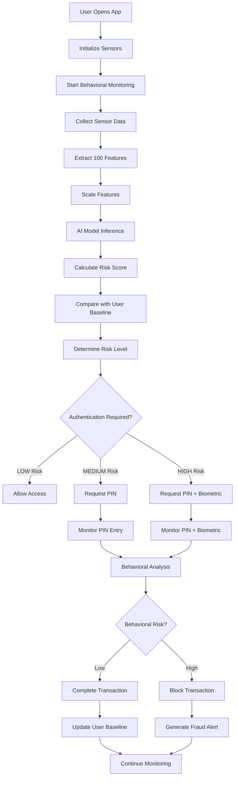
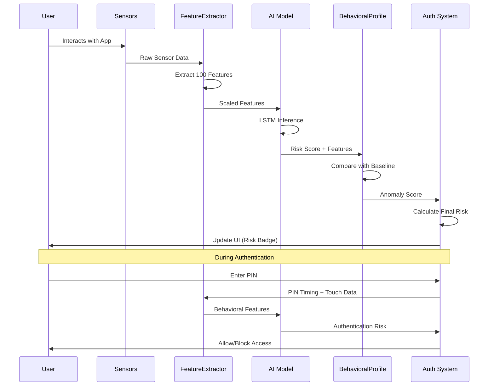
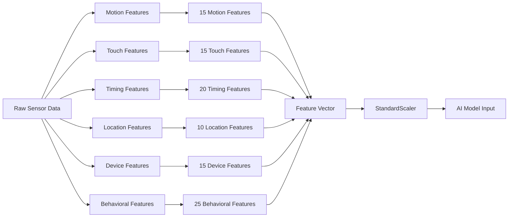
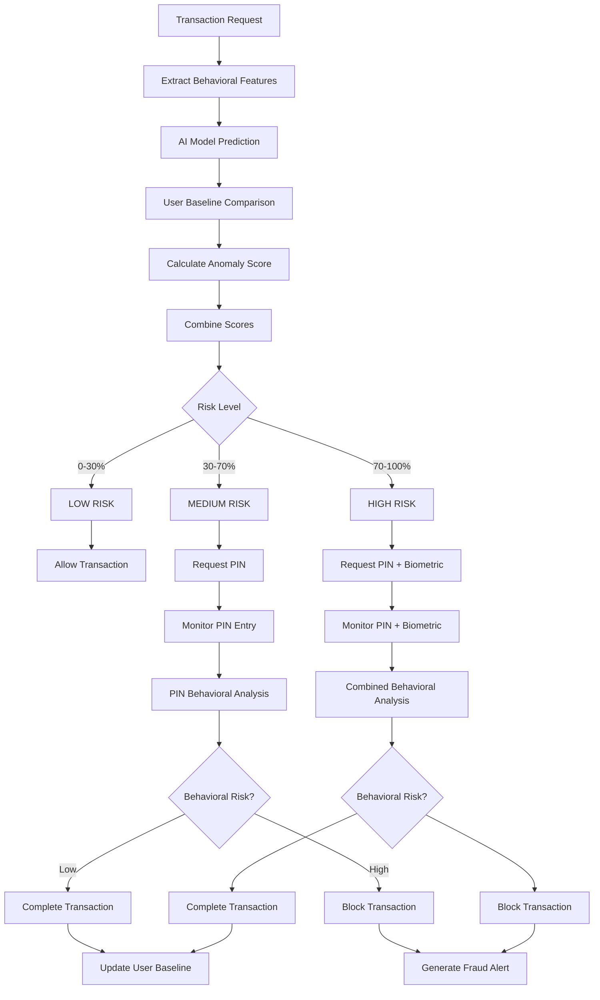

# SecureBank - AI-Powered Banking with BehaviorGuard

SecureBank is a complete React Native Expo banking application that demonstrates advanced behavioral fraud detection using BehaviorGuard AI. The app showcases real-time fraud detection during financial transactions using behavioral biometrics and device sensors.

## 🚀 Current Status

### ✅ Implemented Features
- **Complete Banking UI**: Professional dark theme with all core banking screens
- **Real-time Fraud Detection**: Continuous behavioral monitoring with 100+ features
- **AI Model Integration**: TensorFlow.js with LSTM neural network for risk assessment
- **Sensor Data Collection**: Accelerometer, gyroscope, location, and touch pattern monitoring
- **Risk-based Authentication**: Progressive security based on behavioral risk levels
- **PIN Authentication**: 6-digit PIN with real-time fraud detection
- **Transaction Monitoring**: Risk assessment during money transfers
- **Security Dashboard**: Comprehensive security analytics and fraud alerts
- **Behavioral Profiling**: User baseline learning and adaptive thresholds
- **Offline Processing**: Local AI inference for privacy and speed

### 🔄 In Development
- **Biometric Authentication**: Fingerprint/face ID integration (UI ready, backend pending)
- **Advanced Analytics**: Enhanced behavioral pattern analysis
- **Performance Optimization**: Model inference optimization
- **Testing Suite**: Comprehensive test coverage expansion

## 🚀 Features

### Core Banking Features
- **Modern Banking UI**: Professional, clean design with dark theme
- **Account Management**: View balances, transaction history, and account details
- **Money Transfers**: Send money to other accounts with real-time fraud detection
- **Transaction History**: Comprehensive transaction tracking with fraud risk indicators
- **Settings Management**: User preferences and security configuration

### BehaviorGuard AI Integration
- **Real-time Fraud Detection**: Continuous monitoring during app usage
- **100+ Behavioral Features**: Motion, touch, timing, location, and device patterns
- **AI-Powered Risk Assessment**: Neural network with LSTM architecture
- **Risk-Based Authentication**: Progressive security based on risk levels
- **Offline Processing**: Local AI inference for privacy and speed

### Security Features
- **PIN Authentication**: 6-digit PIN with behavioral monitoring
- **Biometric Authentication**: Fingerprint/face ID integration
- **Risk Indicators**: Visual feedback for security status
- **Fraud Alerts**: Real-time notifications for suspicious activity
- **Security Dashboard**: Comprehensive security analytics

### Behavioral Monitoring
- **Device Motion**: Accelerometer and gyroscope analysis
- **Touch Patterns**: Pressure, duration, and area monitoring
- **Timing Analysis**: PIN entry timing and transaction patterns
- **Location Tracking**: Geographic pattern analysis
- **Device State**: Battery, network, and orientation monitoring

## 🏗️ Architecture

### Tech Stack
- **React Native 0.74.5**: Cross-platform mobile development
- **Expo SDK 51**: Latest Expo features and tooling
- **TypeScript**: Type-safe development with strict configuration
- **TensorFlow.js 4.20.0**: AI model inference with LSTM architecture
- **Zustand**: Lightweight state management
- **React Navigation**: Screen navigation and routing
- **Expo Sensors**: Device sensor integration

### Project Structure
```
src/
├── components/          # Reusable UI components
│   ├── auth/           # Authentication components (BiometricAuthModal)
│   ├── RiskBadge.tsx   # Risk indicator components
│   └── BehavioralAdaptationStatus.tsx # Behavioral status display
├── screens/            # Application screens
│   ├── LoginScreen.tsx # Email/password authentication
│   ├── PINEntryScreen.tsx # 6-digit PIN with fraud detection
│   ├── DashboardScreen.tsx # Main dashboard with security status
│   ├── TransferScreen.tsx # Money transfer with risk assessment
│   ├── TransactionsScreen.tsx # Transaction history with risk indicators
│   ├── SecurityDashboardScreen.tsx # Comprehensive security analytics
│   └── SettingsScreen.tsx # User preferences and security configuration
├── services/           # Business logic and APIs
│   ├── fraud/          # Fraud detection services
│   │   ├── FraudModelService.ts # AI model integration
│   │   ├── FeatureScaler.ts # Feature normalization
│   │   └── useFraudDetection.ts # React hook for fraud detection
│   ├── sensors/        # Device sensor management
│   │   └── useSensors.ts # Sensor data collection and processing
│   ├── tf/            # TensorFlow integration
│   │   ├── TensorflowService.ts # Model loading and inference
│   │   └── ModelBootstrap.ts # Model initialization
│   ├── BehavioralProfileService.ts # User behavioral profiling
│   ├── BehaviorGuardAI.ts # Core AI inference engine
│   └── FeatureExtractor.ts # Behavioral feature extraction
├── state/              # State management
│   ├── useBehaviorStore.ts # Behavioral data store
│   └── useTransactionStore.ts # Transaction data store
└── types/              # TypeScript type definitions
    └── model.ts # Core data models and interfaces
```

### Fraud Detection Pipeline
1. **Sensor Data Collection**: Continuous monitoring of device sensors (accelerometer, gyroscope, location, touch)
2. **Feature Extraction**: 100 behavioral features from sensor data using FeatureExtractor
3. **Feature Scaling**: Normalization using pre-trained StandardScaler
4. **AI Inference**: Real-time risk assessment using TensorFlow.js LSTM model
5. **Risk Classification**: LOW/MEDIUM/HIGH risk categorization with confidence scores
6. **Behavioral Profiling**: User baseline learning and anomaly detection
7. **Authentication Flow**: Progressive security based on risk level
8. **User Feedback**: Visual indicators and alerts in real-time

## 🔄 System Workflow & Architecture

### Behavioral Authentication Workflow



### Real-time Behavioral Monitoring Flow



### Feature Extraction Process



### Risk Assessment Decision Tree



## ⚙️ Actual Working Implementation

### 1. Sensor Data Collection (`useSensors.ts`)
```typescript
// Real-time sensor monitoring
const sensors = useSensors();
sensors.start(); // Starts accelerometer, gyroscope, location

// Data collection intervals
- Accelerometer: 100ms updates
- Gyroscope: 100ms updates  
- Location: 5s updates, 10m distance threshold
- Touch Events: Real-time pressure, duration, area
- App State: Background/foreground monitoring
```

### 2. Feature Extraction (`FeatureExtractor.ts`)
```typescript
// Extracts 100 behavioral features
const features = FeatureExtractor.extractBehavioralFeatures(
  rawSensorData,
  currentSensorData,
  transactionContext
);

// Feature categories:
- Motion: 15 features (accel/gyro mean, variance, correlation)
- Touch: 15 features (pressure, duration, area, velocity)
- Timing: 20 features (PIN timing, transaction timing, app usage)
- Location: 10 features (geographic patterns, distance, velocity)
- Device: 15 features (battery, network, memory, uptime)
- Behavioral: 25 features (app usage, navigation, security patterns)
```

### 3. AI Model Inference (`BehaviorGuardAI.ts`)
```typescript
// LSTM model architecture
Dense(256) → LSTM(128) → Dense(128) → Dense(64) → Dense(1, sigmoid)

// Real-time inference
const result = await BehaviorGuardAI.infer(scaledFeatures, transaction);
// Returns: { score: 0.0-1.0, label: 'LOW'|'MEDIUM'|'HIGH', confidence }

// Fallback system when AI model unavailable
if (!modelLoaded) {
  return calculateFallbackRisk(features, transaction, userProfile);
}
```

### 4. Behavioral Profiling (`BehavioralProfileService.ts`)
```typescript
// User baseline learning
const baseline = await BehavioralProfileService.updateUserBaseline(
  userId,
  rawFeatures,
  sensorData,
  transaction
);

// Anomaly detection
const anomaly = BehavioralProfileService.calculateAnomalyScore(
  currentFeatures,
  userBaseline
);
// Returns: { score: 0.0-1.0, factors: string[] }
```

### 5. Risk Assessment (`FraudModelService.ts`)
```typescript
// Combined risk calculation
const riskAssessment = await FraudModelService.assessTransactionRisk(
  scaledFeatures,
  transaction,
  userProfile
);

// Risk thresholds
const thresholds = {
  low: 0.3,    // 0-30% = LOW risk
  medium: 0.7, // 30-70% = MEDIUM risk  
  high: 0.9    // 70-100% = HIGH risk
};
```

### 6. Authentication Flow (`useFraudDetection.ts`)
```typescript
// Real-time monitoring hook
const fraudDetection = useFraudDetection('user123', { autoStart: true });

// Risk-based authentication
if (riskLabel === 'LOW') {
  // Allow immediate access
} else if (riskLabel === 'MEDIUM') {
  // Request PIN with behavioral monitoring
  showPINEntry();
} else if (riskLabel === 'HIGH') {
  // Request PIN + biometric with enhanced monitoring
  showPINEntry();
  showBiometricAuth();
}
```

### 7. PIN Entry Monitoring (`PINEntryScreen.tsx`)
```typescript
// Real-time PIN behavioral analysis
const handlePINEntry = (digit: string) => {
  // Collect timing and touch data
  const pinData = {
    digit,
    timestamp: Date.now(),
    touchPressure: currentTouchPressure,
    touchDuration: currentTouchDuration,
    touchArea: currentTouchArea
  };
  
  // Update behavioral monitoring
  fraudDetection.updatePINBehavior(pinData);
  
  // Check for behavioral anomalies
  if (fraudDetection.isPINAnomalous()) {
    showSecurityAlert();
  }
};
```

### 8. Transaction Monitoring (`TransferScreen.tsx`)
```typescript
// Transaction risk assessment
const handleTransfer = async (amount: number, recipient: string) => {
  // Start enhanced monitoring
  fraudDetection.startTransactionMonitoring();
  
  // Real-time risk assessment
  const risk = await fraudDetection.assessTransactionRisk({
    amount,
    recipient,
    location: currentLocation,
    timestamp: Date.now()
  });
  
  if (risk.shouldBlock) {
    showFraudAlert(risk.factors);
    return;
  }
  
  // Proceed with transaction
  await processTransfer(amount, recipient);
};
```

### 9. Security Dashboard (`SecurityDashboardScreen.tsx`)
```typescript
// Real-time security analytics
const SecurityDashboard = () => {
  const { riskScore, riskLabel, fraudAlerts, behavioralPatterns } = fraudDetection;
  
  return (
    <View>
      <RiskBadge risk={riskLabel} score={riskScore} />
      <FraudAlertsList alerts={fraudAlerts} />
      <BehavioralPatternsChart patterns={behavioralPatterns} />
      <SecurityMetrics metrics={securityMetrics} />
    </View>
  );
};
```

### 10. Performance Optimization
```typescript
// TensorFlow.js optimization
- Model warmup on app start
- Tensor memory management with tf.tidy()
- Batch processing for multiple features
- Fallback to heuristic when model unavailable

// Sensor optimization  
- Efficient data buffering
- Background/foreground state management
- Battery-optimized update intervals
- Memory-efficient feature extraction
```

## 📱 Screenshots

### Core Banking Features
- **Login Screen**: Email/password authentication with behavioral monitoring
- **PIN Entry**: 6-digit PIN with real-time fraud detection and risk scoring
- **Dashboard**: Account overview with live security status and risk indicators
- **Transfer**: Money transfer interface with behavioral risk assessment
- **Transactions**: Transaction history with fraud risk indicators and alerts
- **Security Dashboard**: Comprehensive security analytics, fraud alerts, and behavioral patterns
- **Settings**: User preferences, security configuration, and behavioral adaptation settings

### Key Behavioral Features
- **Real-time Risk Scoring**: 0-100% risk assessment with <200ms inference time
- **Visual Risk Indicators**: Green (LOW), Yellow (MEDIUM), Red (HIGH) risk badges
- **Behavioral Pattern Analysis**: Motion, touch, timing, and location anomaly detection
- **Progressive Authentication**: Multi-factor authentication based on risk levels
- **Adaptive Thresholds**: User-specific behavioral baselines and risk thresholds

## 🛠️ Installation & Setup

### Prerequisites
- Node.js 18+ and npm/yarn
- Expo CLI (`npm install -g @expo/cli`)
- iOS Simulator (for iOS development)
- Android Studio (for Android development)

### Quick Start
```bash
# Clone the repository
git clone <repository-url>
cd BehavioGuard

# Run automated setup (recommended)
./setup.sh

# Or manual setup
npm install
npm install react-native-fs@^2.20.0
npx expo start --clear

# Start the development server
npm start

# Run on iOS
npm run ios

# Run on Android
npm run android
```

### Environment Setup
1. **Install Expo Go** on your mobile device
2. **Scan QR code** from the terminal
3. **Configure sensors** (location, biometrics) on device when prompted
4. **Test fraud detection** with different behavioral patterns

### Test Credentials
- **Email**: `user@securebank.com` (or any email)
- **Password**: `password` (or any password)
- **PIN**: `123456`

### Dependencies
```json
{
  "expo": "^51.0.0",
  "@tensorflow/tfjs": "^4.20.0",
  "@tensorflow/tfjs-react-native": "1.0.0",
  "expo-sensors": "~13.0.1",
  "expo-location": "~17.0.1",
  "expo-camera": "^16.1.11",
  "expo-crypto": "~13.0.1",
  "expo-haptics": "~13.0.1",
  "zustand": "^4.5.2",
  "react-native-fs": "^2.20.0"
}
```

## 🔧 Configuration

### Fraud Detection Settings
```typescript
const riskThresholds = {
  low: 0.3,      // Below 30% = LOW risk
  medium: 0.7,   // 30-70% = MEDIUM risk
  high: 0.9      // Above 70% = HIGH risk
};
```

### Sensor Configuration
- **Accelerometer**: 100ms update interval for motion analysis
- **Gyroscope**: 100ms update interval for orientation tracking
- **Location**: 5s update interval, 10m distance threshold
- **Touch Events**: Real-time pressure, duration, and area analysis
- **App State**: Background/foreground monitoring for behavioral patterns

### AI Model Configuration
- **Model Architecture**: Dense(256) → LSTM(128) → Dense(128) → Dense(64) → Dense(1, sigmoid)
- **Input Features**: 100 behavioral indicators in specific order
- **Model Size**: ~489KB optimized for mobile inference
- **Inference Time**: <200ms on modern devices
- **Fallback System**: Heuristic-based risk assessment when AI model unavailable

## 🧪 Testing

### Fraud Simulation
The app includes built-in fraud simulation capabilities:
- **High-Risk Transactions**: Large amounts (>₹50,000) trigger higher risk assessment
- **Behavioral Anomalies**: Different touch patterns, timing variations
- **Location Anomalies**: Transactions from unknown or unusual locations
- **Device Compromise**: Unusual sensor readings and patterns

### Testing Scenarios
1. **Normal Usage**: Standard banking operations with expected LOW risk
2. **Risk Escalation**: Progressive risk increase through unusual behavior
3. **Authentication Flow**: PIN entry with real-time fraud detection
4. **Transaction Monitoring**: Money transfers with behavioral risk assessment
5. **Alert Management**: Fraud alert handling and user notifications
6. **Settings Configuration**: Security preference changes and behavioral adaptation

### Current Test Coverage
- ✅ FeatureScaler: Feature normalization and scaling
- 🔄 Component Testing: UI component behavior validation
- 🔄 Integration Testing: Service interaction testing
- 🔄 E2E Testing: Complete user flow testing

## 🔒 Security Features

### Privacy Protection
- **Local Processing**: All AI inference happens on-device using TensorFlow.js
- **Data Encryption**: Sensitive data encrypted in AsyncStorage
- **User Consent**: Clear privacy controls and settings
- **Minimal Data Collection**: Only necessary behavioral features collected

### Fraud Prevention
- **Real-time Monitoring**: Continuous behavioral analysis during app usage
- **Risk-based Blocking**: Automatic transaction blocking for high-risk scenarios
- **Multi-factor Authentication**: PIN + behavioral + location verification
- **Anomaly Detection**: Pattern-based fraud identification using LSTM neural network

### Behavioral Security
- **User Profiling**: Individual behavioral baseline learning
- **Adaptive Thresholds**: Personalized risk assessment based on user patterns
- **Continuous Learning**: Ongoing behavioral pattern updates
- **Anomaly Scoring**: Deviation from established behavioral patterns

## 📊 Behavioral Features

### Motion Analysis (15 features)
- Accelerometer mean/variance/correlation (X, Y, Z axes)
- Gyroscope patterns and stability measurements
- Device orientation and movement consistency
- Motion pattern correlation analysis

### Touch Patterns (15 features)
- Pressure sensitivity and consistency measurements
- Touch duration and area analysis
- Velocity and acceleration patterns
- Correlation between touch parameters
- Touch pattern variance and stability

### Timing Analysis (20 features)
- PIN entry timing patterns and consistency
- Transaction completion times and patterns
- App usage patterns and frequency analysis
- Time-of-day and day-of-week behavioral patterns
- Navigation timing and screen transition patterns
- Background/foreground timing analysis

### Location Patterns (10 features)
- Geographic consistency and pattern analysis
- Distance from known locations and travel patterns
- Location change frequency and velocity
- Location accuracy and reliability metrics
- Geographic behavioral baseline learning

### Device State (15 features)
- Battery level and charging pattern analysis
- Network connectivity type and strength monitoring
- Memory and storage usage patterns
- Device uptime and restart pattern analysis
- Device model and capability assessment

### Behavioral Indicators (25 features)
- App usage patterns and frequency
- Navigation behavior and screen preferences
- Transaction frequency and amount patterns
- Security interaction patterns and preferences
- Authentication success/failure patterns
- Alert response and user behavior patterns

## 🚀 Deployment

### Production Build
```bash
# Build for production
expo build:android
expo build:ios

# Or use EAS Build
eas build --platform all
```

### App Store Deployment
1. **Configure app.json** with production settings
2. **Set up signing certificates** for iOS/Android
3. **Build production APK/IPA** files
4. **Submit to app stores** with security documentation

### Security Considerations
- **API Key Management**: Secure storage of external API keys
- **Certificate Pinning**: Prevent man-in-the-middle attacks
- **Code Obfuscation**: Protect intellectual property
- **Runtime Protection**: Anti-tampering measures

## 🤝 Contributing

### Development Guidelines
1. **TypeScript**: Strict type checking enabled with comprehensive type definitions
2. **Code Style**: ESLint and Prettier configuration for consistent code
3. **Testing**: Jest test suite for critical components and services
4. **Documentation**: Comprehensive code comments and type definitions

### Testing Strategy
- **Unit Tests**: Individual component and service testing
- **Integration Tests**: Service interaction and data flow testing
- **E2E Tests**: Complete user flow and authentication testing
- **Performance Tests**: Load testing and memory usage optimization

### Code Review Process
1. **Feature Branch**: Create feature-specific branches
2. **Pull Request**: Submit changes for review with comprehensive description
3. **Code Review**: Peer review and feedback on implementation
4. **Testing**: Automated and manual testing validation
5. **Merge**: Approved changes merged to main branch

## 📚 Documentation

### API Reference
- **Fraud Detection API**: Risk assessment and behavioral monitoring
- **Sensor Management**: Device sensor integration and data collection
- **Authentication API**: PIN and behavioral verification
- **Transaction API**: Banking operations with fraud detection
- **Behavioral Profiling**: User baseline learning and adaptation

### User Guide
- **Getting Started**: First-time setup and configuration
- **Security Features**: Understanding fraud detection and behavioral monitoring
- **Troubleshooting**: Common issues and solutions
- **Best Practices**: Security and privacy recommendations

### Developer Guide
- **Architecture Overview**: System design and component interactions
- **Integration Guide**: Adding new fraud detection features
- **Performance Optimization**: Best practices for mobile AI inference
- **Security Implementation**: Fraud detection algorithms and behavioral analysis

## 📄 License

This project is licensed under the ISC License - see the [LICENSE](LICENSE) file for details.

## 🙏 Acknowledgments

- **BehaviorGuard AI**: Advanced fraud detection algorithms and behavioral analysis
- **Expo Team**: Excellent React Native development platform and tooling
- **TensorFlow.js**: Mobile-optimized AI inference and model deployment
- **React Native Community**: Open-source mobile development ecosystem

## 📞 Support

### Getting Help
- **Documentation**: Comprehensive guides and tutorials in QUICK_START.md
- **Issues**: GitHub issue tracking and resolution
- **Community**: Developer forums and discussions
- **Enterprise Support**: Professional support and consulting available

### Contact Information
- **Email**: support@securebank.com
- **GitHub**: [SecureBank Repository](https://github.com/securebank)
- **Documentation**: [docs.securebank.com](https://docs.securebank.com)

---

**SecureBank** - Protecting your financial future with AI-powered behavioral security.

*Built with ❤️ using React Native, Expo, TensorFlow.js, and BehaviorGuard AI*


